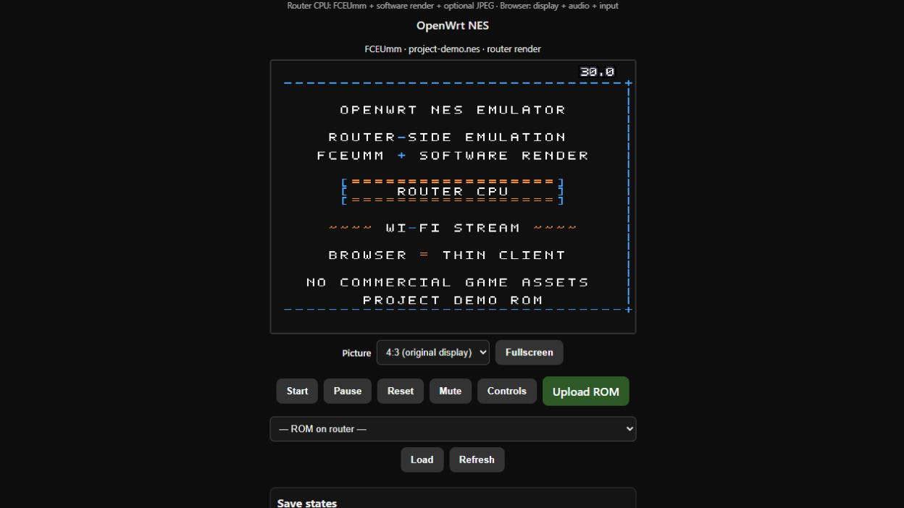
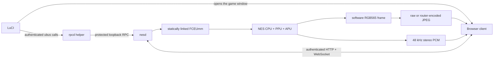

<div align="center">

# OpenWrt NES Emulator

**A joke that became a fully functional, router-side NES emulator for OpenWrt.**

FCEUmm runs on the router. LuCI is the front door. Your browser is the screen,
speakers, and controller.


</div>

<p align="center">
  
</p>

> [!NOTE]
> No commercial ROMs, BIOS files, Nintendo artwork, or game assets are included.
> The screenshot uses the project's original, redistributable demo ROM.

> [!CAUTION]
> `nesd` is a plain-HTTP/WebSocket service intended for a trusted LAN. Never
> forward port `29876` to the Internet. Use a VPN or a trusted HTTPS reverse
> proxy for remote access.

The current package version is **1.0.0-r19**. It is not part of the official
OpenWrt feeds.

## What makes it wonderfully unreasonable

- **The router really does the emulation.** NES CPU/PPU emulation, generation
  of the 256×240 game frame, software RGB565 rendering, and optional JPEG
  encoding all run on the router CPU.
- **The browser stays a thin client.** It receives frames, converts raw RGB565
  or decodes JPEG, scales the canvas, plays PCM audio, draws the FPS OSD, and
  sends controller input. It does not emulate the NES.
- **It feels like an emulator.** Custom keyboard bindings, standard browser
  gamepads, optional touch controls, fullscreen, 4:3 and 16:9 display modes,
  mute, reset, pause, and a FCEUX-style numeric FPS overlay are included.
- **Full-machine save states.** Ten per-ROM slots include CPU, RAM, PPU, APU,
  mapper state, a portable screenshot, labels, checksums, and rollback-safe
  loading. Battery-backed SRAM is persisted separately and atomically.
- **Router-friendly failure behavior.** Media queues are bounded, stale video
  is discarded, JPEG encoding runs in a lower-priority worker, audio has a
  short ordered jitter buffer, and dead connections release their viewer and
  controller leases.
- **A real OpenWrt package.** The project includes procd/UCI integration, a
  LuCI application, an authenticated rpcd bridge, upgrade migrations, CI, and
  deterministic release tooling.

## Compatibility

| OpenWrt series | Package path | Status |
|---|---|---|
| 25.12 | Prebuilt APK v3 feeds and SDK/buildroot recipe | Primary release target |
| 24.10 | SDK/buildroot recipe producing IPK packages | Source-build path |

The standalone release builder covers 35 ABI values pinned for OpenWrt 25.12
and produces 70 APKs: `nes-emulator` plus `luci-app-nes-emulator` for every
ABI. ABI compatibility does **not** guarantee that a particular router has
enough flash, RAM, CPU time, or Wi-Fi throughput for the selected settings.

## Quick install

As root on an OpenWrt 25.12 router, this one-liner downloads the installer to a
private temporary file. It detects the router and APK ABI, selects the latest
release's matching packages, verifies both, and installs the daemon and LuCI UI:

```sh
( f="$(mktemp /tmp/openwrt-nes-installer.XXXXXX)" || exit 1; trap 'rm -f -- "$f"' 0; uclient-fetch -q -T 30 -O "$f" https://raw.githubusercontent.com/communism420/openwrt-nes-emulator/main/install.sh && test -s "$f" && sh "$f" )
```

The installer refuses non-25.12 firmware, opkg-based releases, and unknown
ABIs. You can [review `install.sh`](install.sh) before running it. For a manual
installation:

1. On the router, find the package ABI:

   ```sh
   apk --print-arch
   ```

2. From the GitHub release, download `SHA256SUMS` and the two APK assets whose
   filenames end with that exact ABI. Keep the native and LuCI package
   revisions identical:

   ```text
   nes-emulator-1.0.0-r19-<ABI>.apk
   luci-app-nes-emulator-1.0.0-r19-<ABI>.apk
   ```

3. Verify them, install the trusted LuCI dependencies from your configured
   OpenWrt feeds, then install both local APKs together without consulting any
   repository while `--allow-untrusted` is active:

   ```sh
   ABI="$(apk --print-arch)"
   grep -F -- "-${ABI}.apk" SHA256SUMS > "SHA256SUMS.${ABI}"
   test "$(wc -l < "SHA256SUMS.${ABI}")" -eq 2
   sha256sum -c "SHA256SUMS.${ABI}"
   apk --update-cache --wait 120 add luci-base rpcd
   apk --repositories-file /dev/null --no-network --no-cache \
    --allow-untrusted --wait 120 add \
    "./nes-emulator-1.0.0-r19-${ABI}.apk" \
    "./luci-app-nes-emulator-1.0.0-r19-${ABI}.apk"
   ```

4. Open **LuCI → Services → NES Emulator**, upload a ROM you are legally
   entitled to use, and open the Play tab.

Unsigned packages intentionally require `--allow-untrusted`. Public releases
should be accompanied by the exact corresponding-source archive and checksums.
For local feeds, signed builds, OpenWrt 24.10, SDK builds, all supported ABI
names, and upgrade details, see the
[complete installation guide](docs/TECHNICAL.md#building-in-an-openwrt-sdkbuildroot).

## How it works



FCEUmm is pinned to commit
[`76f68314ce4213703174108f461c431001dcc204`](https://github.com/libretro/libretro-fceumm/commit/76f68314ce4213703174108f461c431001dcc204).
The archive, both local hardening patches, and the complete patched tree are
verified by SHA-256 before release builds. The core is linked directly into
`nesd`; release ELFs have no `PT_INTERP` or `DT_NEEDED` entries.

## Controls and display

The browser stores keyboard mappings and picture preferences per router
origin. Every NES button has a primary and alternate binding; duplicate keys
are rejected. Standard browser gamepads remain independent of keyboard
customization. The on-screen D-pad and action buttons can be disabled for a
clean desktop layout and restored from LuCI at any time.

Fullscreen fits the complete frame inside the actual viewport, including safe
areas. Choose **4:3 (original display)** for the intended television shape or
**16:9 (stretch)** for a widescreen fill without cropping. The numeric FPS OSD
is drawn over the game canvas in the FCEUX style and measures completed client
canvas updates after transport coalescing and JPEG decoding.

## Save states

The game client provides **ten full-machine save slots** for each ROM. States
are keyed by the SHA-256 of the exact loaded ROM and its effective PAL/NTSC
region, not merely by filename. Atomic writes, bounded sizes, integrity checks,
and an in-memory rollback snapshot protect the running game from corrupt or
incompatible state files.

The format is designed to be portable between supported router ABIs using the
same pinned core revision. See the
[save-state and storage reference](docs/TECHNICAL.md#save-states) for limits,
permissions, SRAM behavior, and validation details.

## Performance, honestly

Emulation follows the core's native cadence: approximately 60 FPS for NTSC or
50 FPS for PAL. `stream_fps` is an independent 1–60 FPS delivery ceiling and
defaults to a conservative 2 FPS.

One raw RGB565 frame is 120 KiB. That is about **59.0 Mbit/s at 60 FPS**;
48 kHz stereo PCM raises the combined stream to roughly **60.5 Mbit/s at
60 FPS**, before WebSocket and Wi-Fi overhead. Maximum FPS is therefore a
ceiling, not a promise. Use JPEG and/or 1–2 FPS on weak routers or crowded
2.4 GHz networks.

The FCEUX-like pixel OSD counts canvas updates completed by the client. It can
reveal delivery, decode, paint, or browser slowdowns, but it is not the core's
nominal cadence or the configured stream limit.

Read the [transport and latency design](docs/TECHNICAL.md#operation) for the
bounded queues, heartbeat leases, reconnect behavior, audio freshness policy,
and JPEG-worker architecture.

## Security model

- `nesd` runs as a dedicated unprivileged user.
- ROM, save, and system directories are not world-accessible.
- A random bearer token lives outside UCI in a `root:nesd`, mode `0640` file.
- The game API and WebSocket require authentication; an unauthenticated
  `/play` response contains only the static client shell. CORS preflight is the
  only tokenless API exception.
- The normal standalone game client uses same-origin access. A custom
  cross-origin client must match one explicitly configured Origin.
- Authentication over plain HTTP provides no confidentiality. Keep the service
  on a trusted LAN, VPN, or trusted TLS reverse proxy.

Please report vulnerabilities according to [SECURITY.md](SECURITY.md). Never
attach an auth token, private ROM, save file, signing key, or router backup to
a public issue.

## Build and test

For an OpenWrt SDK/buildroot, add `package/` as a local feed and select:

```text
Games -> nes-emulator
LuCI  -> 3. Applications -> luci-app-nes-emulator
```

The standalone APK builder uses Zig, pinned OpenWrt 25.12.5 toolchains, and
apk-tools v3. It publishes its output atomically and does not upload anything.
See the [full build and release reference](docs/TECHNICAL.md) before creating
binary releases.

Generate the original ROM used by the screenshot without downloading any game
assets:

```sh
python3 scripts/make-demo-rom.py /tmp/openwrt-nes-demo.nes
```

The generated NROM and its pixel artwork are project-authored and MIT-licensed.

Run the repository contracts on Linux or WSL:

```sh
sh scripts/check.sh
```

CI additionally fetches and verifies the pinned FCEUmm source, applies both
verified patches, builds a fully static musl `nesd`, checks its ELF metadata,
and runs the black-box integration suite.

## Repository map

| Path | Purpose |
|---|---|
| `package/nes-emulator/` | Native daemon, procd/UCI integration, FCEUmm patches |
| `package/luci-app-nes-emulator/` | LuCI UI, ACLs, and authenticated rpcd backend |
| `package/libretro-fceumm/` | Transitional upgrade metapackage |
| `scripts/` | Checks, demo-ROM/client generation, and release builder |
| `tests/` | Static, contract, transport, and black-box regression tests |
| `docs/TECHNICAL.md` | Complete operational and release reference |
| `docs/PUBLISHING.md` | GitHub settings, release assets, and launch checklist |

## Contributing

Bug reports and focused pull requests are welcome. Read
[CONTRIBUTING.md](CONTRIBUTING.md) first, run `sh scripts/check.sh`, and never
commit commercial ROMs, save data, credentials, or private signing keys.

## License and legal notice

The original host, OpenWrt integration, LuCI application, documentation, and
project-authored assets are MIT-licensed. FCEUmm is GPL-2.0-only. Because the
distributed `nesd` statically links FCEUmm, the combined executable is
distributed under GPL-2.0-only. See [LICENSE](LICENSE) and
[THIRD_PARTY_NOTICES.md](THIRD_PARTY_NOTICES.md).

This is an unofficial community project. It is not affiliated with or endorsed
by Nintendo, OpenWrt, the OpenWrt Project, libretro, or the FCEUmm maintainers.
NES is a trademark of Nintendo. Use ROMs only when you have the legal right to
do so.

## Acknowledgements

- [FCEUmm](https://github.com/libretro/libretro-fceumm) for the emulator core.
- [libretro](https://www.libretro.com/) for the core API ecosystem.
- [OpenWrt](https://openwrt.org/) and [LuCI](https://github.com/openwrt/luci)
  for making a router an entirely reasonable place to put a game console.
